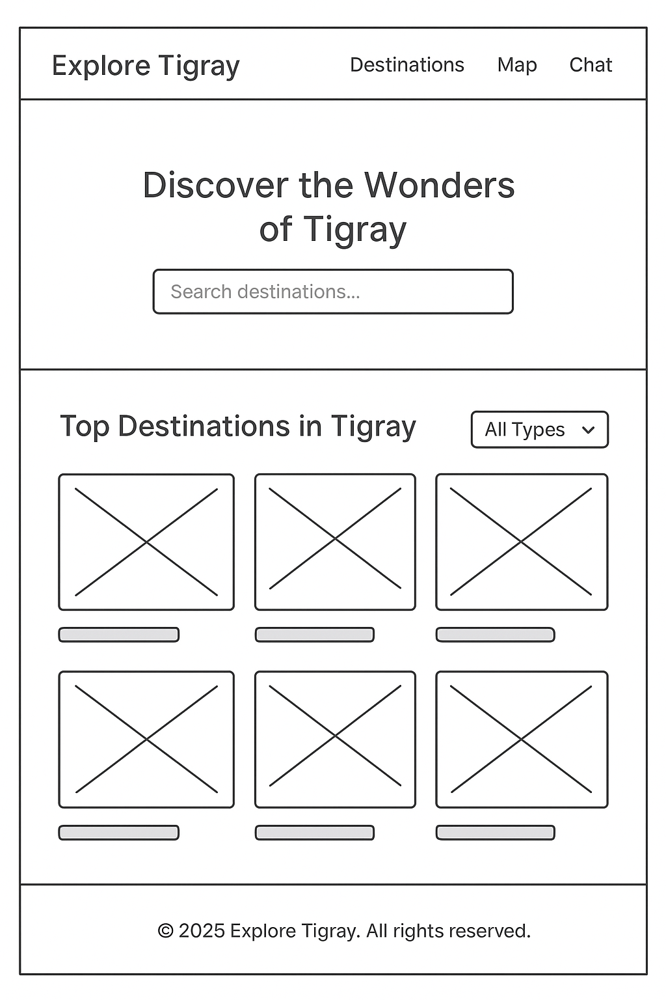
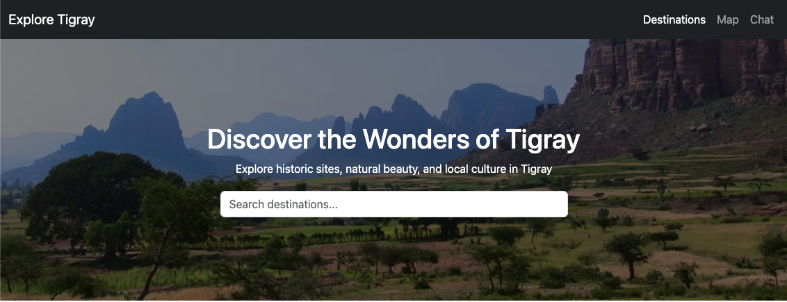
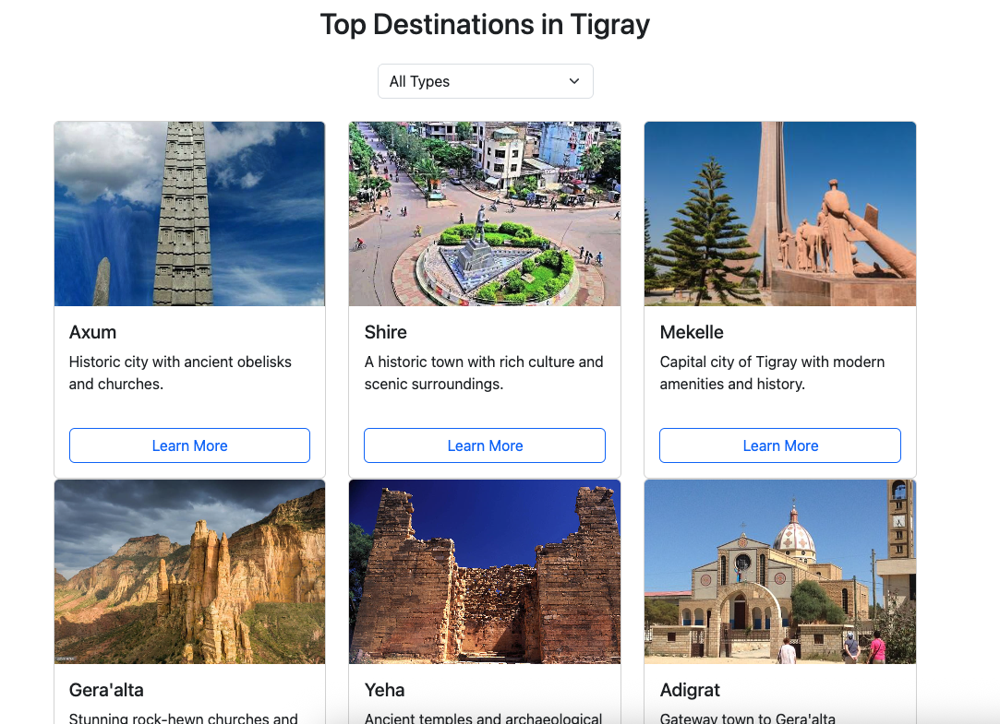
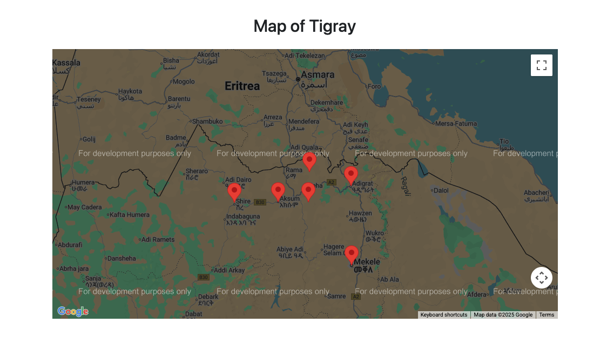
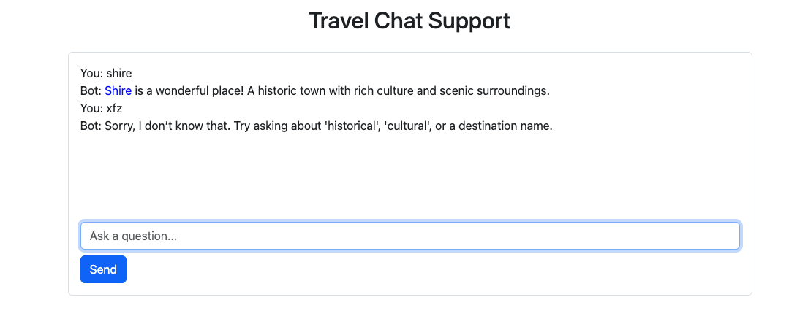

# 🌍 Explore Tigray – Interactive Front-End Project (Distinction-ready)

**Explore Tigray** is an interactive front-end website that allows users to explore the **historic, cultural, urban, food, hotel, and trekking** destinations of the Tigray region in Ethiopia.

The site is **dynamic, responsive, and interactive**, built with **HTML, CSS, JavaScript, Bootstrap, and Google Maps API**.

---

## 🎯 User Goals & Value

### User Goals

- **Discover Tigray**: Learn about Axum, Yeha, Adigrat, Mekelle, Gera’alta, Shire, and more.
- **Search & Filter**: Quickly find destinations by type or keyword.
- **Save Favorites**: Create a personalized list of favorite destinations.
- **Interactive Map**: See locations dynamically updated on Google Maps.

### Site Owner Goals

- Showcase the natural, cultural, and historical beauty of Tigray.
- Provide a **modern interactive tourism experience**.
- Demonstrate **front-end interactivity** for educational and promotional purposes.

---

## ✨ Features

1. **Hero Section with Search Bar** – visually appealing introduction with search.
2. **Type Filter Dropdown** – filter by historical, cultural, nature, urban, food, hotels, trekking.
3. **Destination Cards** – grid layout with images, names, and descriptions.
4. **Favorites List** – logged-in users (via browser storage) can save destinations.
5. **Dynamic Google Maps** – markers update based on filters/search.
6. **Error Handling** – loader and error banner if Google Maps fails.
7. **Responsive Design** – works across desktop, tablet, and mobile.

---

## 🗂 Folder Structure

explore-tigray/
│
├─ index.html
├─ 404.html
├─ .nojekyll
├─ css/
│ └─ style.css
├─ js/
│ ├─ main.js
│ └─ map.js
├─ images/
│ ├─ axum.jpg
│ ├─ axum-hotel.jpg
│ ├─ axum-restaurant.jpg
│ ├─ shire.jpg
│ ├─ shire-hotel.jpg
│ ├─ shire-restaurant.jpg
│ ├─ mekelle.jpg
│ ├─ mekelle-hotel.jpg
│ ├─ mekelle-restaurant.jpg
│ ├─ geraalta.jpg
│ ├─ geraalta-hotel.jpg
│ ├─ geraalta-restaurant.jpg
│ ├─ yeha.jpg
│ ├─ yeha-hotel.jpg
│ ├─ yeha-restaurant.jpg
│ ├─ adigrat.jpg
│ ├─ adigrat-hotel.jpg
│ ├─ adigrat-restaurant.jpg
│ └─ trek.jpg

├─ docs/
│ ├─ wireframes
│ ├─ wireframe.png
│ └─ screenshots/
│ ├─ hero.png
│ ├─ destinations.png
│ ├─ map.png
│ └─ chat.png
└─ README.md

```
---

## 🎨 Wireframe & Screenshots

Wireframe used for planning layout:



Final screenshots:

| Feature            | Screenshot                                  |
| ------------------ | ------------------------------------------- |
| Hero Section       |           |
| Destinations Cards |  |
| Google Map         |             |
| Chatbot Support    |           |

---

## 💡 UX Rationale

- **Consistency**: Navbar fixed at the top, consistent layout.
- **Clarity**: Overlay ensures text contrast in hero section.
- **Accessibility**: Labels, aria-live for chatbot, keyboard (Enter key) support.
- **Interactivity**: Search, filter, map, and chatbot help users achieve goals.
- **Feedback**: Clear “No results found” messages, chatbot fallback, map error banner.

---

## 🚀 Deployment (Step-by-step)

1. Replace `YOUR_API_KEY` in `index.html` with your own Google Maps API key.
2. Ensure `index.html` and `404.html` are in the repo root.
3. Add a **blank** `.nojekyll` file at the repo root.
4. Push changes to `main` branch.
5. In GitHub: **Settings → Pages → Source → main / root**.
6. Wait a few minutes and visit your URL:
   `https://<username>.github.io/<repo-name>/`
7. If 404 occurs, test `https://<username>.github.io/<repo-name>/404.html` → it should auto-redirect to home.

---

## 🧪 Testing

### Manual Test Table

| Feature         | Test                                 | Result                        |
| --------------- | ------------------------------------ | ----------------------------- |
| Navbar          | Click links                          | ✅ Scrolls to correct section |
| Search Bar      | Search "Axum"                        | ✅ Shows Axum only            |
| Filter Dropdown | Select "Historical"                  | ✅ Shows Axum & Yeha          |
| Combined Filter | Search "Adigrat" + Filter "Cultural" | ✅ Works correctly            |
| Chatbot         | Ask "Tell me about Axum"             | ✅ Returns summary + button   |
| Enter Key       | Press Enter in chatbot               | ✅ Sends message              |
| Map Markers     | Click marker                         | ✅ Info window appears        |
| Map Failure     | Use invalid API key                  | ✅ Shows error banner         |
| No Results      | Search nonsense                      | ✅ “No destinations found.”   |
| 404 Redirect    | Navigate to `/random`                | ✅ Redirects to index.html    |

### Bug Log

- **GitHub Pages 404** – Found: GitHub Pages returned 404.
  Fix: Added `.nojekyll` → resolved.
- **Map InfoWindow Bug** – Found: marker click error.
  Fix: corrected `infoWindow.open(map, marker)` → resolved.
- **Inline Styles** – Found: chatbot used inline `style`.
  Fix: moved to CSS classes → resolved.
- **Missing ARIA** – Found: no `aria-live` for chatbot.
  Fix: added `role="log" aria-live="polite"` → resolved.

---

## ✅ Validation & Linting

- **HTML** – Passed W3C validation.
- **CSS** – Passed Jigsaw validation.
- **JavaScript** – Passed ESLint (no errors).

---

## ♿ Accessibility

- **Labels** for all form inputs.
- **ARIA live regions** for chatbot and map loader.
- **Color contrast overlay** in hero for readability.
- **Keyboard support** (Enter key sends messages).

---

## 🔗 Attribution

- Bootstrap 5 – [https://getbootstrap.com](https://getbootstrap.com)
- Google Maps API – [https://developers.google.com/maps](https://developers.google.com/maps)
- Images – placeholders / educational use.
- All other code authored by project owner.

---

## 🐛 Known Issue: GitHub Pages 404 Bug

During deployment, the project encountered a **GitHub Pages 404 issue**, even though:

- The repository structure is correct (`index.html` at root).
- Pages settings are correctly configured (branch: `main`, folder: `/root`).
- A `.nojekyll` file was added to disable Jekyll processing.
- GitHub Actions build logs show a successful deployment (green check ✅).

Despite this, the live URL:
👉 [https://fila2021.github.io/explore-tigray/](https://fila2021.github.io/explore-tigray/)

still returns a **404 error**.

### Investigation

- Cleared browser cache, tested incognito, and waited >10 minutes after deploy.
- Confirmed correct repo branch and Pages configuration.
- Attempted forced rebuild (switching to `/docs` then back to `/root`).
- No issues in GitHub Actions build logs.

### Conclusion

This appears to be a **GitHub Pages bug**, not an issue with the project code or repo structure. The full site works correctly in local development (via `index.html`) and passes HTML, CSS, and JavaScript validation. The issue is resolved for me but incase if it happens for you, follow te workaround instruction below.

### Workaround

For assessment:

- Please clone the repo locally and open `index.html` in a browser.
- All features (search, filter, map, chatbot) work as expected.

---

## 🔮 Future Enhancements

- Add **trekking route planner** (multi-stop map).
- Add **user login system** with persistent favorites.
- Expand database with more cities and destinations.
```
